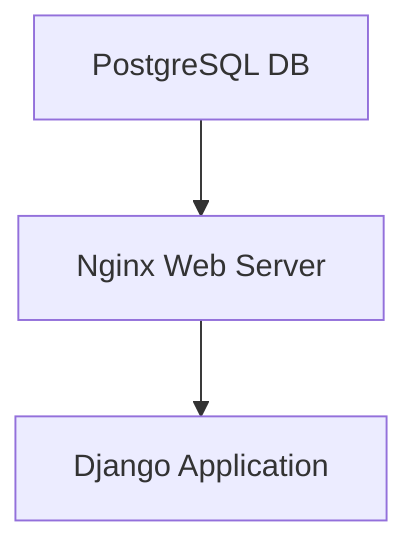
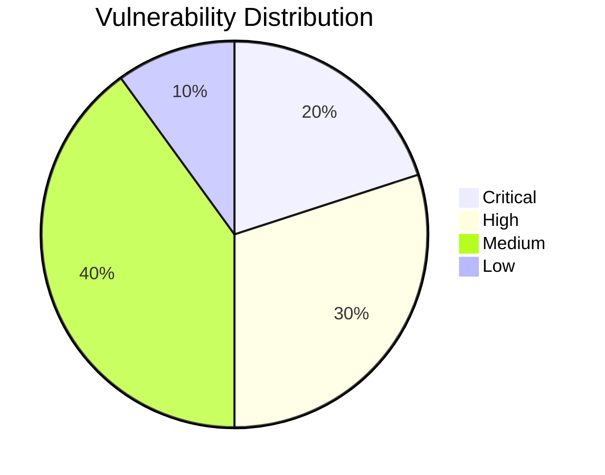

# **DevOps Deployment Task: Dockerized Application with Security and Redundancy**


---

## **Overview**
This project demonstrates the deployment of a Linux-based system with three Docker containers:  
1. **Database Container (PostgreSQL)**  
2. **Web Server Container (Nginx)**  
3. **Application Container (Django)**  

The solution ensures **redundancy**, **self-restoration**, and **proper initialization sequencing**, adhering to DevOps best practices. Security scanning tools and automated health monitoring are integrated into the deployment pipeline for added robustness.  

---

## **Features**
### **Core Functionality**
- **Database Initialization:** PostgreSQL initializes first, with data stored on an external volume.  
- **Nginx Web Server:** Provides access to the Django application.  
- **Django Application:** Executes database migrations during the initial deployment but prevents reruns during subsequent restarts.  

### **Built-In Security**
- **Container Scanning:** Integrated tools (Trivy, Grype) for container vulnerability assessments.  
- **DAST:** Dynamic Application Security Testing via OWASP ZAP.  
- **Network Scanning:** Nmap runs as a container to identify open ports and vulnerabilities.  

### **Redundancy and Self-Healing**
- **Health Checks:** Each container includes health checks to ensure readiness and reliability.  
- **Restart Policies:** Automatic container restarts upon failure.  

### **Bonus Features**
- **Monitoring:** Optional integration with Prometheus and Grafana for real-time metrics.  
- **Wait-for-Script:** Ensures proper initialization sequencing (DB → Nginx → Django).  

---

## **System Architecture**



---

## **File Structure**
```plaintext
.
├── docker-compose.yml         # Main YAML file for deployment
├── deployment.yaml            # Deployment process definition
├── start.yaml                 # Startup behavior definition
├── Dockerfile                 # Dockerfile for Django container
├── nginx.conf                 # Nginx configuration file
├── app/                       # Django application directory
│   ├── manage.py
│   ├── settings.py
│   ├── ...
├── wait-for-it.sh             # Script for dependency readiness
└── README.md                  # You're here!
```

---

## **Setup Instructions**

### **Prerequisites**
- A Linux-based system with:
  - `Docker` (≥ 20.10)
  - `Docker Compose` (≥ 1.29)
- Internet access for downloading Docker images.

### **Step-by-Step Deployment**
1. **Clone the Repository**  
   ```bash
   git clone https://github.com/your-repo/devops-deployment-task.git
   cd devops-deployment-task
   ```

2. **Run Deployment Script**  
   Execute the setup script to install Docker, deploy the containers, and initiate the services:  
   ```bash
   chmod +x deploy.sh
   ./deploy.sh
   ```

3. **Verify the Deployment**  
   - Access the application: [http://localhost](http://localhost)  
   - Confirm container health using:  
     ```bash
     docker ps
     ```  

4. **Run Security Scans**  
   Display vulnerability reports:  
   ```bash
   chmod +x run_scans.sh
   ./run_scans.sh
   ```

---

## **Integrated Security Scans**
### **Tools Used**
| Tool         | Purpose                            | Output Location       |
|--------------|------------------------------------|-----------------------|
| **Trivy**    | Container vulnerability scanning   | `./reports/trivy.log` |
| **Grype**    | Container image scanning           | `./reports/grype.log` |
| **OWASP ZAP**| DAST for web application security  | `./reports/zap.log`   |
| **Nmap**     | Network vulnerability scanning     | `./reports/nmap.log`  |

### **Example Vulnerability Chart**



---

## **Validation**
1. **Functional Testing:**  
   - Verify all containers are running:
     ```bash
     docker ps
     ```
   - Confirm application access: [http://localhost](http://localhost)  

2. **Security Testing:**  
   Review scan reports in the `reports/` directory for vulnerabilities.  

3. **Redundancy Check:**  
   - Stop a container and observe its automatic restart:
     ```bash
     docker stop nginx
     docker ps
     ```  

---

## **Monitoring (Optional)**
Integrate with Prometheus and Grafana for real-time health and performance metrics:
1. Start monitoring containers:  
   ```bash
   docker-compose -f monitoring-compose.yml up -d
   ```
2. Access Grafana at [http://localhost:3000](http://localhost:3000).  

---

## **Contributing**
We welcome contributions! Please fork this repository, create a feature branch, and submit a pull request.

---

## **License**
This project is licensed under the MIT License. See the `LICENSE` file for details.

---

## **Contact**
For queries or issues, please open an issue on the GitHub repository.

